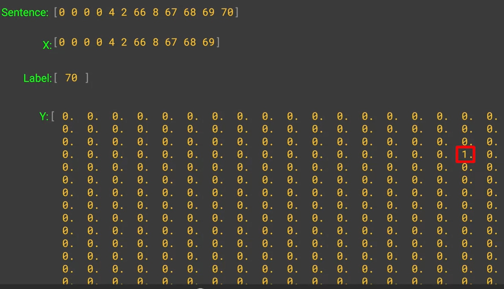

- Keras utility to convert list to a categorical.
- Labels have list of words and next is num. of words in list.
- X is the input of sequence to be fed and label has the prediction index.
- Ys is the one hot-code in array, of size of corpus of words, with value 1 at 70th index of label.
- Ys is obtained after performing following operation.

`ys = tf.keras.utils.to_categorical(labels, num_classes=total_words)`

## References
1. https://colab.research.google.com/github/lmoroney/dlaicourse/blob/master/TensorFlow%20In%20Practice/Course%203%20-%20NLP/Course%203%20-%20Week%204%20-%20Lesson%201%20-%20Notebook.ipynb#scrollTo=6Vc6PHgxa6Hm